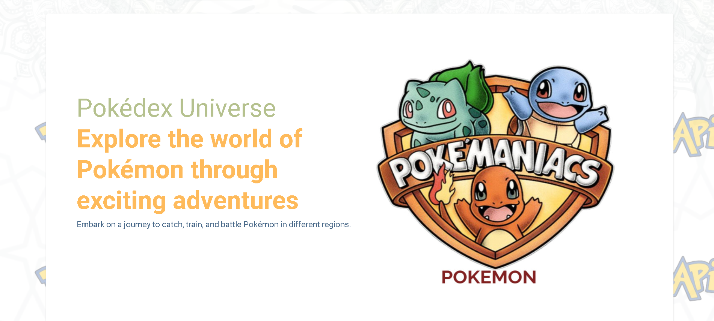
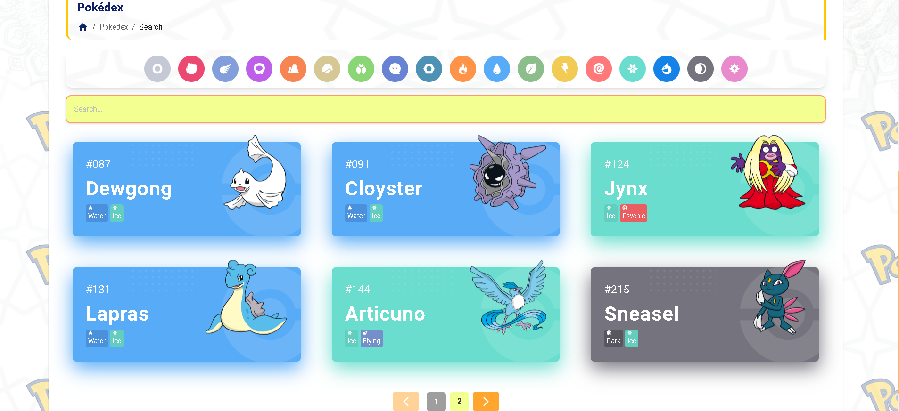

<br />
<p align="center">
<div align="center">
  
</div>
  <h3 align="center">Pokédex | App</h3>
  <p align="center">
    <a href="https://github.com/preedok/pokeibal"><strong>Explore the docs »</strong></a>
    <br />
    <a href="https://pokeibal.vercel.app/">View Demo</a>
    ·
    <a href="https://pokeapi.co/">Api Demo</a>
  </p>
</p>

<!-- TABLE OF CONTENTS -->

## Table of Contents

- [Table of Contents](#table-of-contents)
- [About The Project](#about-the-project)
- [Getting Started](#getting-started)
  - [Prerequisites](#prerequisites)
  - [Installation](#installation)
- [Screenshots](#screenshots)
- [Contributing](#contributing)
- [Related Project](#related-project)
- [Meet The Teams](#meet-the-teams)

<!-- ABOUT THE PROJECT -->

## About The Project

Pokémon initiative is aimed at creating a comprehensive and immersive experience centered around the popular Pokémon franchise. This project caters to fans, developers, and researchers by providing resources, tools, and platforms to engage with Pokémon in various innovative ways.

<!-- GETTING STARTED -->

## Getting Started

### Prerequisites

This is an example of how to list things you need to use the software and how to install them.

- [Tailwind Css](https://tailwindcss.com/)
- [React js](https://reactjs.org/)

### Installation

- Clone This Front End Repo

```
git clone https://github.com/preedok/pokeibal
```

- Go To Folder Repo

```
cd POKEIBAL
```

- Install Module

```
npm install
```

- Type ` npm run dev` To Start Website


<!-- ROADMAP -->

## Screenshots

<table>
 <tr>
    <td></td>
    <td> </td>
  </tr>
   <tr>
    <td>Header Page</td>
    <td>Pokemon Search</td>
  </tr>
</table>

<!-- CONTRIBUTING -->

## Contributing

Contributions are what make the open source community such an amazing place to be learn, inspire, and create. Any contributions you make are **greatly appreciated**.

1. Fork the Project
2. Create your Feature Branch (`git checkout -b feature/AmazingFeature`)
3. Commit your Changes (`git commit -m 'Add some AmazingFeature'`)
4. Push to the Branch (`git push origin feature/AmazingFeature`)
5. Open a Pull Request

## Related Project

:rocket: [`Frontend Pokeibal`](https://github.com/preedok/pokeibal)

:rocket: [`Demo Pokeibal`](https://pokeibal.vercel.app/)

<!-- Meet The Teams -->

## Meet The Teams

<center>
  <table align="center">
    <tr >
    <th >Frontend Developer</th>
    </tr>
    <tr >
      <td align="center">
        <a href="https://github.com/preedok">
          <br/>
          <b>Muhamad Iqbal Aprido</b>
        </a>
      </td>
    </tr>
  </table>
</center>

Project Link: [https://github.com/preedok/pokeibal](https://github.com/preedok/pokeibal)
